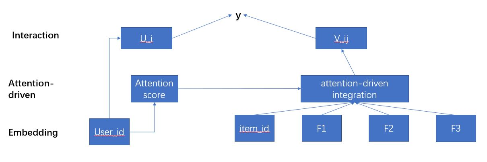
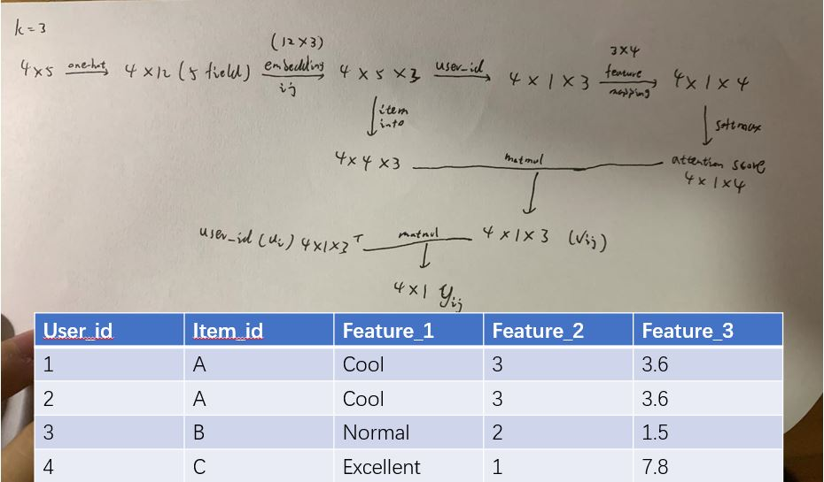
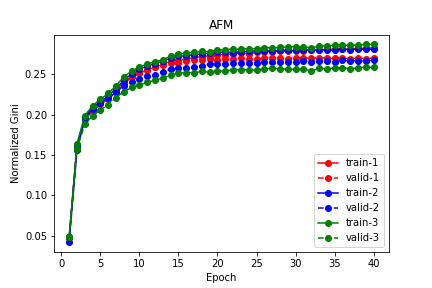
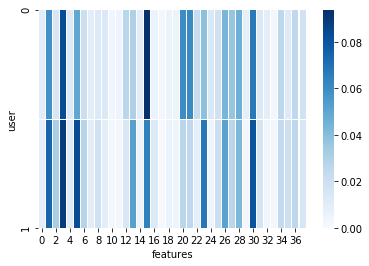

# Attention-driven-factor-model
# tensorflow-AFM

This project includes a Tensorflow implementation of AFM [1].

# Introduction

AFM is attention-driven factor model, which is an interpretable model for the recommendation system. With AFM you could know each users preference on the features of the items. For the detail information, please read the paper.

## Input Format

This implementation requires the input data in the following format:

- [ ] **Xi**: *[[ind1_1, ind1_2, ...], [ind2_1, ind2_2, ...], ..., [indi_1, indi_2, ..., indi_j, ...], ...]*
  - *indi_j* is the feature index of feature field *j* of sample *i* in the dataset
- [ ] **Xv**: *[[val1_1, val1_2, ...], [val2_1, val2_2, ...], ..., [vali_1, vali_2, ..., vali_j, ...], ...]*
  - *vali_j* is the feature value of feature field *j* of sample *i* in the dataset
  - *vali_j* can be either binary (1/0, for binary/categorical features) or float (e.g., 10.24, for numerical features)
- [ ] **y**: target of each sample in the dataset (1/0 for classification, numeric number for regression)

Please see `example/DataReader.py` an example how to prepare the data in required format for AFM.

## Architecture





# Example

The example part gets inspirations from the Chen's project, if you want get detailed introduction, please go to https://github.com/ChenglongChen/tensorflow-DeepFM

Folder `example` includes an example usage of AFM models for [Porto Seguro's Safe Driver Prediction competition on Kaggle](https://www.kaggle.com/c/porto-seguro-safe-driver-prediction)

Please download the data from the competition website and put them into the `example/data` folder.

To train AFM model for this dataset, run

```
$ cd example
$ python main.py
```

Please see `example/DataReader.py` how to parse the raw dataset into the required format for AFM.

## Performance

### AFM



### Explanation



I randomly choose two users to show their preference for explanation. Each row represent one user's preference.  Darker color means higher attention on this feature.

# Reference

[1] *Attention-driven Factor Model for Explainable Personalized
Recommendation*, Jingwu Chen, Fuzhen Zhuang, Xin Hong, Xiang Ao, Xing Xie, Qing He.

# Acknowledgments

This project gets inspirations from the following projects:

- [ ] ChenglongChen's tensorflow-DeepFM(https://github.com/ChenglongChen/tensorflow-DeepFM)

